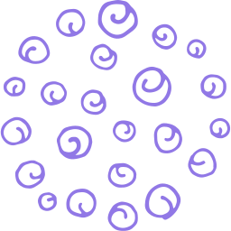

# Data Dots

Handle thousands of tiny json data "dots".



DataDots is a plain, reasonably powered, database of JSON-files.

## Motivation

-   Being JSON-native makes data easy to work with and easy to debug and understand (all you need is a text editor).
-   Being append-only means the data is almost impossible to corrupt
-   Being text-based means it is easy to compress, share, and transmit
-   Being JSON, records are easy to rewrite/transform as the application grows and morphs.
-   Being file-based, it is easy to create per-user or per-tenant files and manage them naturally.

## QuickStart

Install:

```sh
npm install datadots
```

Use:

```javascript
import dots, { memoryPersister, browserPersister } from "datadots";
import diskPersister from "datadots/diskPersister";

const dot = await dots.setup("/path/to/datafile", {
    saveEvery: 5, // seconds
    persister: diskPersister(), // or memoryPersister or browserPersister or your own
});

```

Add Record:

```javascript
const datum = { key: value, key2: value2 };
dot.add(datum);
```

Query Records:

```javascript
dot.q((records) => {
    console.log(`There are ${records.length} records`);
});
```

Closing:

```javascript
await dot.close();
await dots.shutdown();
```
